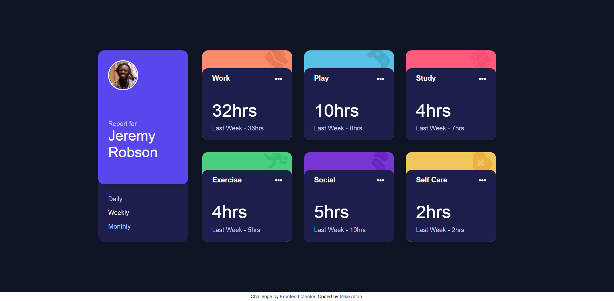

# Frontend Mentor - Time tracking dashboard solution

This is a solution to the [Time tracking dashboard challenge on Frontend Mentor](https://www.frontendmentor.io/challenges/time-tracking-dashboard-UIQ7167Jw). Frontend Mentor challenges help you improve your coding skills by building realistic projects.

## Table of contents

- [Overview](#overview)
  - [The challenge](#the-challenge)
  - [Screenshot](#screenshot)
  - [Links](#links)
- [My process](#my-process)
  - [Built with](#built-with)
  - [What I learned](#what-i-learned)
  - [Continued development](#continued-development)
- [Author](#author)

## Overview

### The challenge

Users should be able to:

- View the optimal layout for the site depending on their device's screen size
- See hover states for all interactive elements on the page
- Switch between viewing Daily, Weekly, and Monthly stats

### Screenshot

### Links

- View Submission: [Frontend Mentor](https://www.frontendmentor.io/solutions/html5-css3-javascript-UJH-1WFHN)
- View Site: [GitHub Pages](https://mikeattah.github.io/frontend-mentor-time-tracking-dashboard/)

## My process

### Built with

- Semantic HTML5 markup
- CSS custom properties
- JavaScript
  - Fetch API

### Continued development

I will continue to learn about how to use fetch API for getting, posting, patching, and deleting data.

## Author

- Website: [mikeattah.com](https://mikeattah.com)
- Frontend Mentor: [@mikeattah](https://www.frontendmentor.io/profile/mikeattah)
- Twitter: [@mikeattahh](https://www.twitter.com/mikeattahh)
